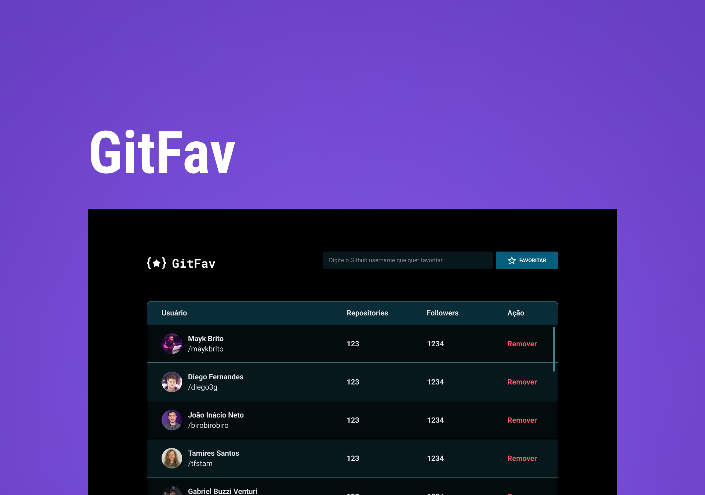

# GIT-FAV

Projeto como desafio do nível 06 do explorer , onde utilizei a api do github para ter informações sobre os usuários e poder selecionar quais são os favoritos.

## Tecnologias utilizadas:

- HTML5;
- CSS3;
- JAVASCRIPT;

## Funcionalidades:

- Buscar usuário;
- Remover usuário da lista;
- Informações do usuário como total de repositórios e seguidores;
- Não cadastra usuário já cadastrado;
- Acessar link do perfil do usuário no github;
- Os usuário ficam salvos no localStorage;

